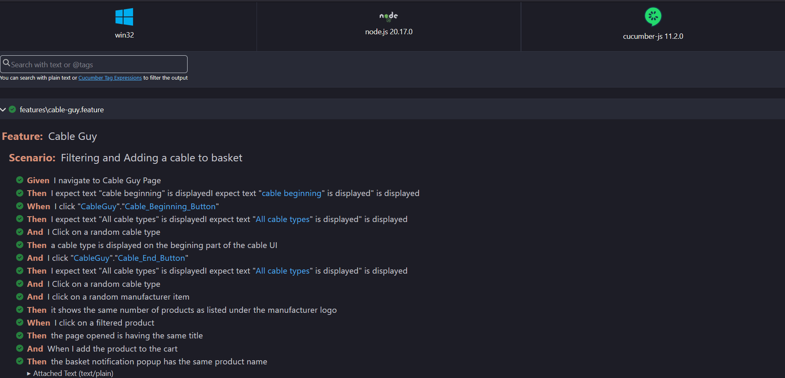
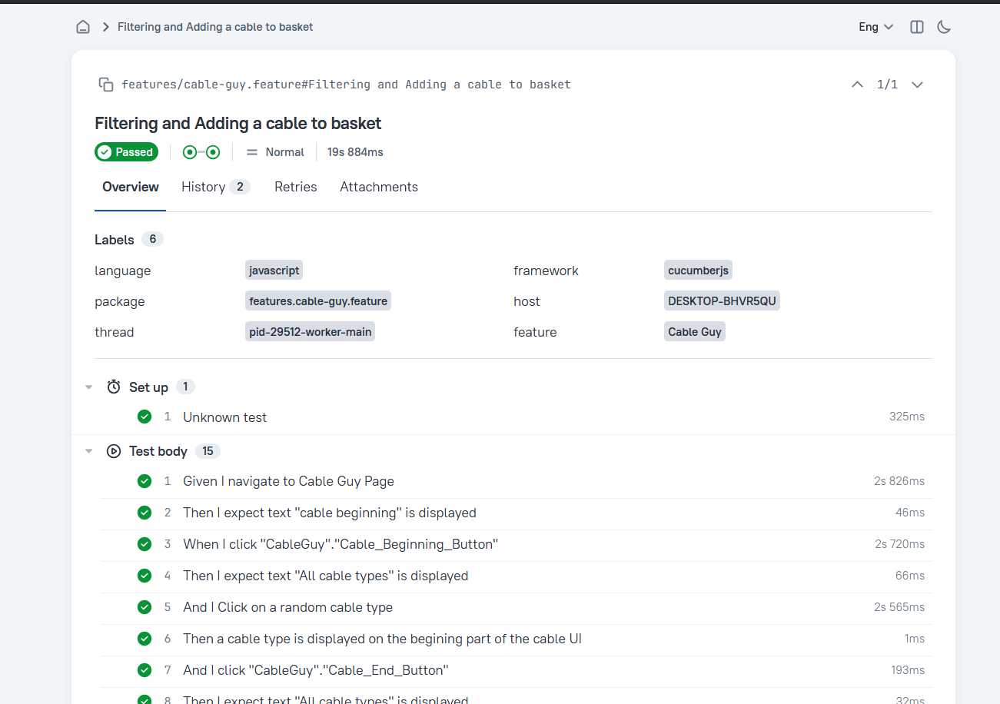

#### To run the automated scripts,

- Make sure the latest version of [NodeJs and NPM](https://nodejs.org/en) is installed and th system.
- Open a terminal clone this repo and `cd` to the root directory in this repo
- If this is the first time Playwright is run on the PC, it is better to run `npx playwright install` to install playwright browsers which is a dependency to run these tests and will not be installed as part of the package restore.
- Run `npm i` to install all dependent packages
- Optional: Run `npm i -g allure-commandline` to install allure cli for rendering allure reports
- Run `npm run all` to execute the tests, For adjusting the source code parameters, refer the following source code guidelines.

#### Source code structure and configurations

All the tests, scenarios, expecations and pass/fail conditions are configured and documented in the highly generic and verbose [Gherkin language](https://cucumber.io/docs/gherkin/) as .feature files.

The environment related configuration can be adjusted in the `.env` file in the root directory, Currently the supported configurations and supported values are given below.

- `BROWSER` - The browser for the tests to be run in (`chromium/firefox/webkit`)
- `HEADLESS` - Whether to run the tests in headless mode (`true/false`)
- `APP_ENV` - App environment, Different URLs and settings can be specified based on application environment in `urls.ts` file (`DEVELOP/PROD`)
- `USE_ALLURE` - Whether to use Allure reports for reporting. (`true/false`)
  > If this option is used, Make sure to install the allure report cli from the allure reports website as given in the setup

Once a test instance has been run successfully, The report will be generated in the `/reports` directory with the name `report.html` this will have the test parameters, scenarios, steps, conditions, expected values and other parameters and durations for each tests as an HTML report

> Only the failed tests include screenshots and to turn it on for all the tests regardless of test status. Please adjust the condition on `src/support/common-hooks.ts` line: 116.

- On consequtive runs of the tests, the test report will be overwritten, but the traces and screenshots will be available in the `traces` directory as zip files

##### Using Allure reports as report output

- Make sure the allure-cli is installed
- Set `USE_ALLURE` to `true`
- Run the tests, the allure results will be in the directory `./reports/allure/results` directory
- Open a terminal and cd to the root directory
- Run the command `allure generate ./reports/allure/results/ -o ./reports/allure/report/`
- The report will be generated as an html file in the directory `./reports/allure/report/`
- run the command `allure open ./reports/allure/report/` to open the report

